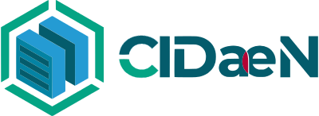

<h1 align="center">Biblioteca</h1>

  

---
Bienvenido a la biblioteca de CIDaeN, aquí puedes echar un vistazo
a los trabajos de fin de máster pasados.

 Promoción: 2022 

| author           | title                                                                 | link                                          |
|------------------|-----------------------------------------------------------------------|-----------------------------------------------|
| Agustín Piqueres | Clasificación de movimientos de CrossFit, una aplicación con MoViNets | [enlace](./trabajos/2022/agustin_piqueres.md) |

---

## Quieres ayudar a tus compañeros?

Por favor, entra en el siguiente enlace para ver como contribuir con tu
propio trabajo:

[CONTRIBUTING.md](CONTRIBUTING.md)

Toda la información es totalmente opcional. Si algún campo no quieres
rellenarlo, déjalo en blanco. La idea es saber en que han trabajado
otros compañeros, por si pudiera ayudar a otra persona a saber que
temas se han tratado, o por simple curiosidad.